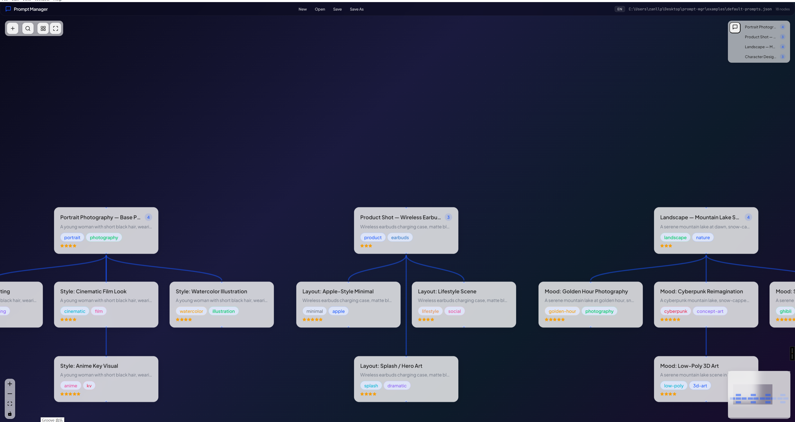
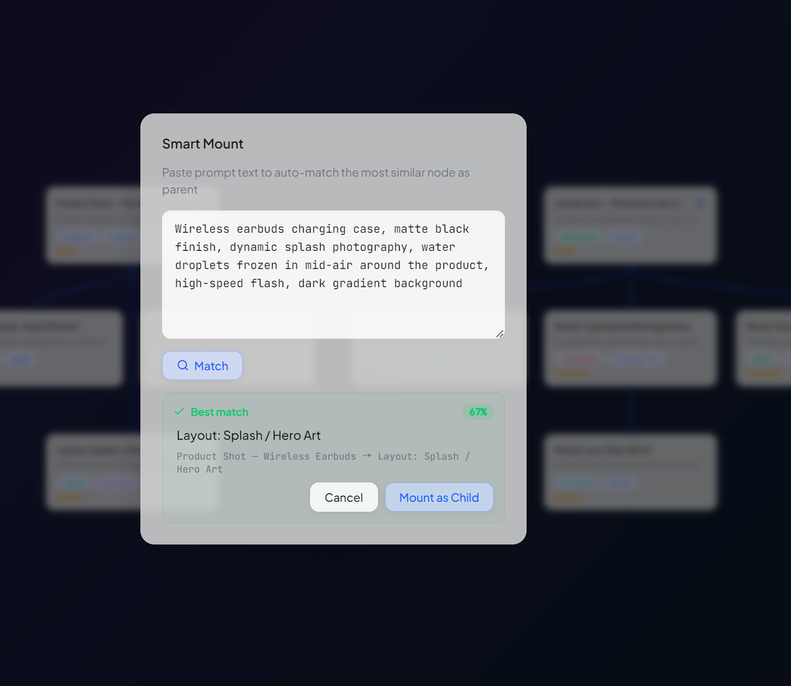
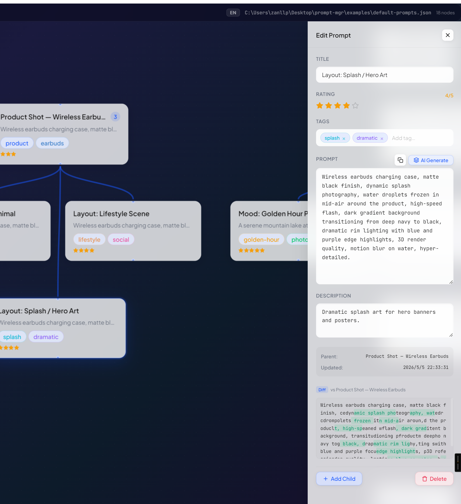

# PromptBonsai

A local desktop app for managing AI prompts on an infinite canvas. Like a bonsai tree — each prompt branches into refined variations, all visible at a glance.


**[中文文档](README.zh-CN.md)**

---

## Why PromptBonsai?

Working with AI often means writing dozens of prompt variations — tweaking wording, style, parameters, iterating on results — and losing track of what worked. PromptBonsai solves this by letting you **visually organize every variant as a tree on an infinite canvas**.



## Core Features

### Smart Mount ⭐

> Probably the most useful feature in PromptBonsai — paste a prompt and AI automatically finds the best parent node for it. No more wondering "where should this go?"

Paste any prompt text and Smart Mount automatically analyzes the content, computes similarity against all existing nodes, and recommends the best match as a parent. It shows a ranked similarity list with detailed diffs — just one click to confirm. **No more manually hunting through your tree.**



### Infinite Canvas

Your entire prompt library lives on one unbounded workspace. Zoom out to see the big picture, zoom in to focus on a single branch. Drag nodes anywhere — the canvas has no edges.

### Tree-Structured Variants

Every prompt can fork into child variants. A base portrait prompt might branch into *Rembrandt lighting*, *cinematic film look*, *watercolor illustration*, *anime KV* — each a single-click detour from the original. The tree structure makes it trivial to compare "what changed" between siblings.

### AI-Powered Diff & Smart Detection

- **Character-level inline diff** — When a child node differs from its parent, PromptBonsai highlights exactly which characters were added (green) or removed (red), so you can see the creative delta at a glance.
- **Similarity warning** — Paste a prompt that's too close to an existing sibling? A diff modal pops up before you save, preventing accidental duplicates.
- **AI auto-generate** — Hit one button and let AI fill in the title, description, and tags based on the prompt content. When creating a child variant, the AI automatically generates a diff-aware title (e.g. "Variant 3: teal-orange grading + bokeh city lights").

### Node Detail Side Panel

Select any node to open the side panel for viewing and editing the prompt content, title, description, tags, rating, and more. Everything at a glance with real-time editing.



### Root Node Quick Index

Working with many independent prompt trees? A collapsible index panel in the top-right corner lists every root node. Click any entry to **fly to it** with a smooth pan-and-zoom, plus a 3-second highlight blink so you never lose it.

### Local-First, JSON-Based

All data is stored as `.json` files on your machine. No accounts, no cloud. Your prompts, your control.

## AI Configuration

The AI auto-generate feature (titles, descriptions, tags, diff-aware titles) uses an OpenAI-compatible API. Configure it on the **welcome page**:

| Field | Description | Example |
|-------|-------------|---------|
| **API Base URL** | OpenAI-compatible endpoint | `https://api.openai.com/v1` |
| **API Key** | Your API key | `sk-…` |
| **Model** | Model name | `gpt-4o`, `deepseek-v3.2-exp`, etc. |

Settings are persisted to `localStorage` and survive restarts.

**Compatible providers** (any OpenAI-compatible API):

| Provider | Base URL |
|----------|-----------|
| OpenAI | `https://api.openai.com/v1` |
| DeepSeek | `https://api.deepseek.com/v1` |
| Ollama (local) | `http://localhost:11434/v1` |
| Azure OpenAI | `https://<resource>.openai.azure.com/openai/deployments/<deployment>` |

> **Privacy**: API calls go directly from your machine to the configured endpoint. PromptBonsai does not proxy or log any requests.

## Workflow

```
1. Write a base prompt (e.g. "Portrait, soft natural light, 85mm")
2. Fork it into style variants (Rembrandt, cinematic, watercolor...)
3. Each variant can fork again (warm tone, cool tone, high contrast...)
4. Rate, tag, and describe each node
5. AI auto-generates titles and diffs for you
6. Export as .json — your prompt tree is portable and shareable
```

## Quick Start

### Prerequisites

- [Node.js](https://nodejs.org/) >= 18
- [Yarn](https://yarnpkg.com/) (or npm)

```bash
git clone <repo-url>
cd prompt-mgr
yarn install
yarn dev
```

On first launch, click **"Open Example"** to load a pre-built prompt library with 4 image-generation trees (portrait, product, landscape, character design) and 18 variants.

### Build

```bash
yarn build:win     # Windows installer
yarn build:unpack  # Portable build
```

## File Format

PromptBonsai saves data as `.json` files:

```json
{
  "version": 1,
  "name": "My Prompts",
  "nodes": {
    "node-abc": {
      "id": "node-abc",
      "parentId": null,
      "childrenIds": ["node-def"],
      "title": "Portrait — Base Prompt",
      "promptText": "A young woman, soft natural light, 85mm...",
      "description": "Base prompt for portrait variations",
      "rating": 4,
      "tags": [{ "name": "portrait", "color": "#1856FF" }],
      "position": { "x": 0, "y": 0 },
      "createdAt": "2026-05-05T10:00:00.000Z",
      "updatedAt": "2026-05-05T10:00:00.000Z"
    }
  },
  "rootIds": ["node-abc"]
}
```

## Tech Stack

| Layer | Tech |
|-------|------|
| Framework | Electron 28 |
| Frontend | Vue 3 (Composition API) + TypeScript |
| Build | Electron Vite |
| State | Pinia |
| Canvas | Vue Flow |
| i18n | vue-i18n (zh-CN / en) |

## Keyboard Shortcuts

| Shortcut | Action |
|----------|--------|
| `Ctrl+N` | New project |
| `Ctrl+O` | Open file |
| `Ctrl+S` | Save |
| `Ctrl+Shift+S` | Save as |
| `Esc` | Close editor panel |

## License

MIT
